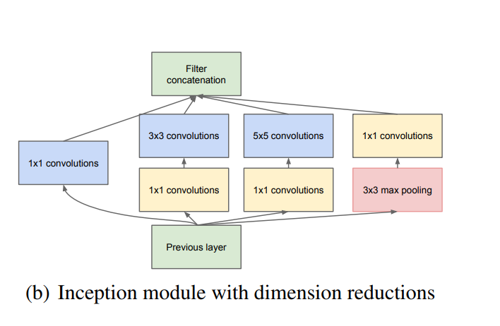

# Assignment 7

### 7A: Calculate the Receptive field of the Inception Net

The first part will be to calculate the receptive field of the Inception Module

There are 4 paths in the Inception Module from left to right

| Path | ReceptiveField |
| --- | --- |
| 1 | Rin|
| 2 | Rin+2\*Jin |
| 3 | Rin+4\*Jin |
| 4 | Rin+2\*Jin |

The Recepive Field's at Filter Concatenation Layer are:
Rin, Rin + 2\*Jin, Rin + 4\*Jin
