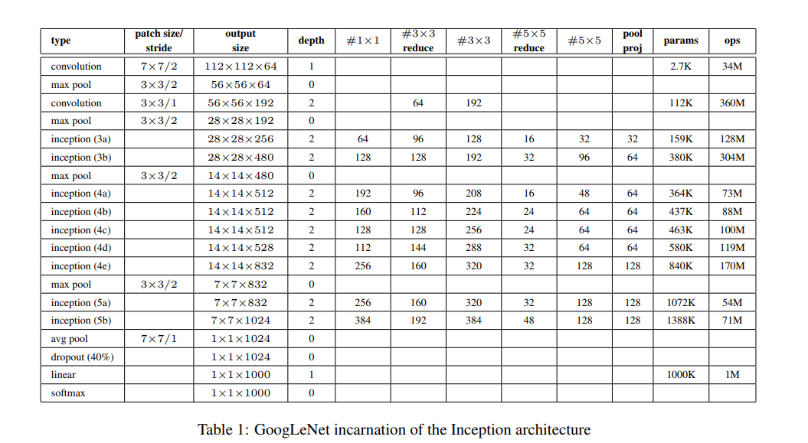

# Assignment 7

## 7A: Calculate the Receptive field of the Inception Net

The first part will be to calculate the receptive field of the Inception Module

There are 4 paths in the Inception Module from left to right

| Path | ReceptiveField |
| --- | --- |
| 1 | Rin|
| 2 | Rin+2\*Jin |
| 3 | Rin+4\*Jin |
| 4 | Rin+2\*Jin |

The Recepive Field's at Filter Concatenation Layer are:
Rin, Rin + 2\*Jin, Rin + 4\*Jin

And since there are not strides=2 in Inception Module,
Jout = Jin

##### Calculation the receptive filed of Inception Net

- **Layer**:Convolution(Nin=224, k=7, p='same', s=2, Jin=1, Rin=1)
	- Nout = 112
	- Jout = Jin\*s = 2
	- Rout = Rin + (k-1)\*Jin = 1 + (7-1)\*1 = 7

- **Layer**:MaxPooling(Nin=112, k=3, p='same', s=2, Jin=2, Rin=7)
	- Nout = 56
	- Jout = Jin\*s = 4
	- Rout = Rin + (k-1)\*Jin = 7 + (3-1)\*2 = 11

- **Layer**:Convolution(Nin=56, k=3, p='same', s=1, Jin=4, Rin=11)
	- Nout = 56
	- Jout = Jin\*s = 4
	- Rout = Rin + (k-1)\*Jin = 11 + (3-1)\*4 = 19

- **Layer**:MaxPooling(Nin=56, k=3, p='same', s=2, Jin=4, Rin=19)
	- Nout = 28
	- Jout = Jin\*s = 8
	- Rout = Rin + (k-1)\*Jin = 19 + (3-1)\*4 = 27

- **Layer**:Inception(Nin=28, Jin=8, Rin=27)
	- Nout = 28
	- Jout = Jin = 8
	- Rout = [Rin, Rin+2\*Jin, Rin+4\*Jin] = [27,43,59] 

- **Layer**:Inception(Nin=28, Jin=8, Rin=[27,43,59])
	- Nout = 28
	- Jout = Jin = 8
	- Rout = [Rin, Rin+2\*Jin, Rin+4\*Jin] = [27,43,59,75,91]

- **Layer**:MaxPooling(Nin=28, k=3, p='same', s=2, Jin=8, Rin=[27,43,59,75,91])
	- Nout = 14
	- Jout = Jin\*s = 16
	- Rout = Rin + (k-1)\*Jin = [27,43,59,75,91,107]

- **Layer**:Inception(Nin=14, Jin=16, Rin=[27,43,59,75,91,107])
	- Nout = 14
	- Jout = Jin = 16
	- Rout = [Rin, Rin+2\*Jin, Rin+4\*Jin] = [27, 59, 43, 75, 107, 123, 139, 155, 171, 91]

- **Layer**:Inception(Nin=14, Jin=16, Rin=[27, 59, 43, 75, 107, 123, 139, 155, 171, 91])
	- Nout = 14
	- Jout = Jin = 16
	- Rout = [Rin, Rin+2\*Jin, Rin+4\*Jin] = [27, 91, 107, 75, 43, 123, 139, 155, 171, 187, 203, 219, 59, 235]

- **Layer**:Inception(Nin=14, Jin=16, Rin=[27, 91, 107, 75, 43, 123, 139, 155, 171, 187, 203, 219, 59, 235])
	- Nout = 14
	- Jout = Jin = 16
	- Rout = [Rin, Rin+2\*Jin, Rin+4\*Jin] = [267, 299,  27,  59, 107,  75,  43, 123, 139, 155, 171, 187, 203,
       219, 251, 283,  91, 235]

- **Layer**:Inception(Nin=14, Jin=16, Rin=[267, 299,  27,  59, 107,  75,  43, 123, 139, 155, 171, 187, 203,
       219, 251, 283,  91, 235])
	- Nout = 14
	- Jout = Jin = 16
	- Rout = [Rin, Rin+2\*Jin, Rin+4\*Jin] = [267, 139, 155, 283,  27, 299,  43, 171,  59, 187, 315, 331,  75,
       203,  91, 219, 347, 363, 107, 235, 251, 123]

- **Layer**:Inception(Nin=14, Jin=16, Rin=[267, 139, 155, 283,  27, 299,  43, 171,  59, 187, 315, 331,  75,
       203,  91, 219, 347, 363, 107, 235, 251, 123])
	- Nout = 14
	- Jout = Jin = 16
	- Rout = [Rin, Rin+2\*Jin, Rin+4\*Jin] = [267, 139, 395,  27, 155, 283, 411, 299,  43, 171, 427,  59, 187,
       315, 331,  75, 203,  91, 219, 347, 363, 107, 235, 123, 379, 251]
	
- **Layer**:MaxPooling(Nin=14, k=3, p='same', s=2, Jin=8, Rin=[267, 139, 395,  27, 155, 283, 411, 299,  43, 171, 427,  59, 187,
       315, 331,  75, 203,  91, 219, 347, 363, 107, 235, 123, 379, 251])
	- Nout = 7
	- Jout = Jin\*s = 32
	- Rout = Rin + (k-1)\*Jin = [395, 139, 267, 155, 411, 283, 427, 299, 171,  59, 315, 443, 187,
       331,  75, 203, 459,  91, 219, 347, 363, 107, 123, 235, 379, 251]
	
- **Layer**:Inception(Nin=7, Jin=32, Rin=[395, 139, 267, 155, 411, 283, 427, 299, 171,  59, 315, 443, 187,
       331,  75, 203, 459,  91, 219, 347, 363, 107, 123, 235, 379, 251])
	- Nout = 7
	- Jout = Jin = 32
	- Rout = [Rin, Rin+2\*Jin, Rin+4\*Jin] = [267, 395, 139, 523, 155, 283, 411, 539, 427, 299, 171, 555,  59,
       315, 187, 443, 571, 331, 459,  75, 203, 587,  91, 219, 347, 475,
       363, 107, 235, 491, 251, 379, 507, 123]

- **Layer**:Inception(Nin=7, Jin=32, Rin=[267, 395, 139, 523, 155, 283, 411, 539, 427, 299, 171, 555,  59,
       315, 187, 443, 571, 331, 459,  75, 203, 587,  91, 219, 347, 475,
       363, 107, 235, 491, 251, 379, 507, 123])
	- Nout = 7
	- Jout = Jin = 32
	- Rout = [Rin, Rin+2\*Jin, Rin+4\*Jin] = [523, 267, 395, 139, 651, 283, 411, 539, 155, 667, 427, 299, 171,
       555, 683,  59, 315, 187, 443, 571, 699, 331, 459,  75, 203, 587,
       715,  91, 219, 347, 475, 603, 635, 363, 107, 235, 491, 123, 619,
       379, 507, 251]

- **Layer**:AvgPool(Nin=7, k=7, p='same', s=1, Jin=32, Rin=[523, 267, 395, 139, 651, 283, 411, 539, 155, 667, 427, 299, 171,
       555, 683,  59, 315, 187, 443, 571, 699, 331, 459,  75, 203, 587,
       715,  91, 219, 347, 475, 603, 635, 363, 107, 235, 491, 123, 619,
       379, 507, 251])
	- Nout = 1
	- Jout = Jin\*s = 32
	- Rout = Rin + (k-1)\*Jin = [395, 523, 139, 267, 651, 779, 155, 283, 411, 539, 667, 427, 171,
       299, 555, 683, 699, 187, 443, 571, 315, 331, 587, 715, 459, 203,
       219, 475, 603, 347, 731, 491, 363, 235, 619, 747, 123, 251, 379,
       507, 635, 763]

The final Layer Receptive Field is :
[395, 523, 139, 267, 651, 779, 155, 283, 411, 539, 667, 427, 171, 299, 555, 683, 699, 187, 443, 571, 315, 331, 587, 715, 459, 203, 
219, 475, 603, 347, 731, 491, 363, 235, 619, 747, 123, 251, 379, 507, 635, 763]
